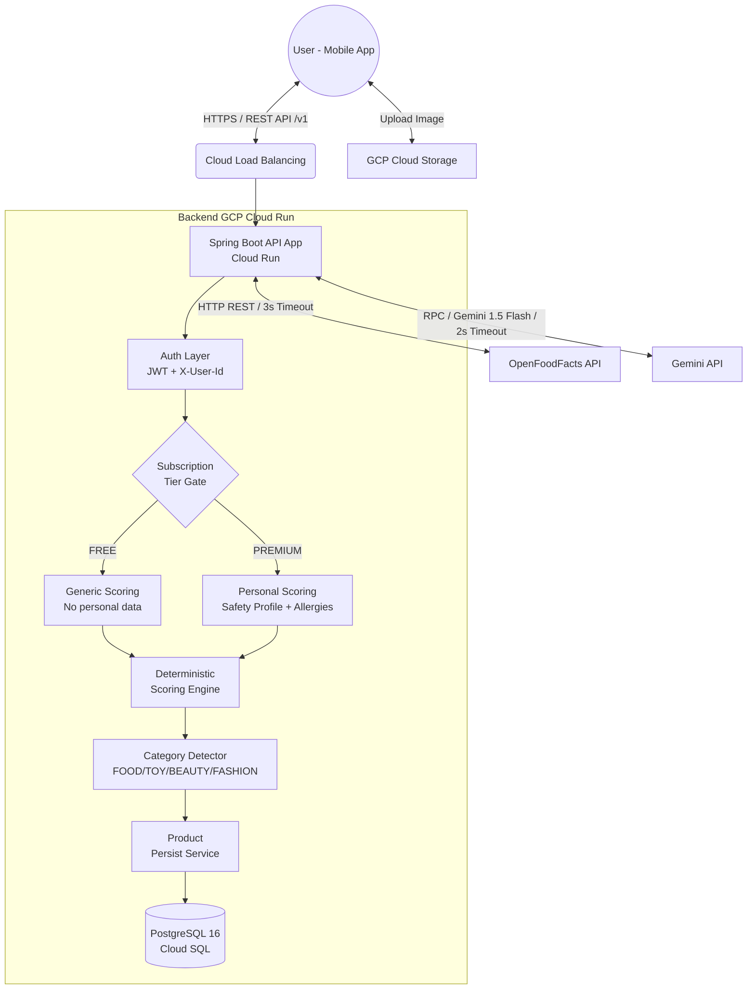

# Kiến trúc Hệ thống V2 (Cập nhật)

Tài liệu này xác định kiến trúc hệ thống tổng thể của DICO Scan, quy định rõ cách thức các luồng dữ liệu tương tác để tối ưu chi phí và duy trì sự ổn định.

## 1. Tổng quan Kiến trúc High-level

Kiến trúc dựa trên nguyên tắc Cloud-Native, tận dụng tối đa Serverless để giảm Cost (Zero-cost khi không có request).



## 2. Các Thành phần (Components & Responsibility)

### 2.1. Frontend (React Native)
- Không chứa logic quy đổi điểm (Xanh/Vàng/Đỏ). Mobile chỉ làm Presentation Layer.
- Hiển thị category-specific warnings (TOY/BEAUTY/FASHION).
- Cache local ảnh ở thiết bị.

### 2.2. Authentication Layer
- **JWT Token**: Sinh bằng `JwtUtil` khi Register/Login. Header `Authorization: Bearer <Token>`.
- **User Context**: `X-User-Id` header truyền UUID user qua mỗi request.
- **BCrypt**: Mã hóa password (BCryptPasswordEncoder).
- **Public endpoints**: `/v1/auth/register`, `/v1/auth/login`.

### 2.3. Subscription Tier Gating
- **FREE**: Scan sản phẩm cơ bản, scoring chung, AI summary generic. Không có personal allergy override.
- **PREMIUM**: Full personalization — safety profile wizard, personal allergy alerts, family profile (child/pregnancy), category-specific AI analysis.
- Gating logic nằm trong `ProductApplicationService` và `UserController`/`SafetyProfileController`.

### 2.4. Service Layer
1. **ProductApplicationService** (Orchestrator): Điều phối toàn bộ luồng đánh giá sản phẩm 7 bước.
2. **ScoringEngineService**: Pure Java, zero I/O. Tính N_Nutri/N_Nova/N_Additives + Overrides.
3. **ProductCategoryDetector**: Phân loại sản phẩm dựa trên `categories_tags` từ OFF.
4. **ProductPersistService**: Tách riêng `@Transactional` operations (Guardrail Rule 6).
5. **GeminiClient**: Gọi AI với category-specific prompt templates.
6. **OpenFoodFactsClient**: Proxy xuống OFF API, xử lý timeout/retry.
7. **SafetyProfileService**: CRUD hồ sơ an toàn questionnaire (PREMIUM).
8. **AuthService**: Register/Login, JWT generation.
9. **UserService**: Cập nhật preferences.

### 2.5. Data Layer (PostgreSQL Cloud SQL)
- **3 bảng**: `users`, `products`, `scan_history`.
- JSONB columns: `preferences`, `profile_data`, `safety_profile`, `off_payload`.
- Flyway migrations (V1-V4).

## 3. Luồng Đánh giá Sản phẩm (7-Step Orchestrator)

```mermaid
sequenceDiagram
    participant Mobile
    participant Controller
    participant Orchestrator
    participant DB
    participant OFF as OpenFoodFacts
    participant Gemini as Gemini AI

    Mobile->>Controller: GET /v1/products/{barcode}
    Controller->>Orchestrator: evaluateProduct(barcode, prefs, userId)
    
    Note over Orchestrator: Step 1 - Load User + Tier
    Orchestrator->>DB: findById(userId)
    DB-->>Orchestrator: User (tier, safetyProfile)
    
    Note over Orchestrator: Step 2 - DB Cache Check
    Orchestrator->>DB: findById(barcode)
    alt Cache HIT + Fresh
        DB-->>Orchestrator: Product (cached)
        Orchestrator-->>Controller: toResponse(cached)
    else Cache MISS
        Note over Orchestrator: Step 3 - Fetch OFF
        Orchestrator->>OFF: GET /api/v2/product/{barcode}
        OFF-->>Orchestrator: OffProductData
        
        Note over Orchestrator: Step 4 - Category Detection
        Note over Orchestrator: Step 5 - Deterministic Scoring
        Note over Orchestrator: Step 6 - Persist to DB
        Orchestrator->>DB: saveProduct(...)
        
        Note over Orchestrator: Step 7 - AI Layer
        Orchestrator->>Gemini: analyze(offData, category, allergies)
        Gemini-->>Orchestrator: AiAnalysisResult
        Orchestrator->>DB: updateAiSummary(...)
        
        Orchestrator-->>Controller: ProductEvaluationResponse
    end
    Controller-->>Mobile: 200 OK (JSON)
```

## 4. Luồng Quản lý Dữ liệu Đóng góp (Crowdsourced Data Flow)
Sản phẩm 404 Not Found kích hoạt luồng Contribution:
- Mobile điều hướng sang màn hình "Chụp Ảnh".
- API `POST /v1/contribute (multipart/form-data)` → 202 ACCEPTED.
- MVP: Log-only. Phase 2+: Upload GCS + async OCR via Pub/Sub.

## 5. Chiến lược Resilience (Phục hồi Lỗi)
Mọi API External Call phải có Retry và Circuit Break:
1. **OpenFoodFacts**: Connection Timeout `1000ms`, Read Timeout `3000ms`. Retry max `2` lần, Fixed Backoff `500ms`.
2. **Gemini AI**: Hard timeout `2000ms`. Không Retry. Fallback → trả sản phẩm không có AI summary.

> ⚠️ **Trạng thái hiện tại**: Circuit Breaker (Resilience4j) chưa triển khai, đang dùng try/catch thủ công. Cần hoàn thiện ở Sprint tiếp theo.
