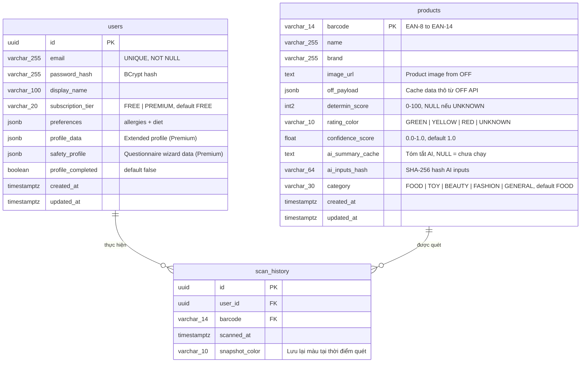

# Lược đồ Dữ liệu và Constraints (PostgreSQL V2 — Cập nhật)

Tài liệu thiết kế cấu trúc CSDL mức vật lý phục vụ khả năng chịu tải cao và tìm kiếm linh hoạt cho DICO Scan. DB sử dụng PostgreSQL 16+.

## 1. Sơ đồ Thực thể (ERD)

## 2. Table Schemas, Constraints & Indexes

### Bảng `users`
Bảng lưu trữ người dùng, xác thực, cấu hình cá nhân và hồ sơ an toàn.
- **Constraints**:
  - `email` phải duy nhất (Unique Constraint).
  - `subscription_tier` mặc định `FREE`, chỉ chấp nhận `FREE` hoặc `PREMIUM`.
  - `profile_completed` mặc định `false`.
  - Khóa chính UUID v4 sinh tự động.
- **Indexes**:
  - B-tree Index trên `email`.
  - **GIN Index trên trường `preferences`**: Hỗ trợ tìm kiếm siêu tốc trên JSON `user.preferences.allergies`.
  - `CREATE INDEX idx_users_prefs ON users USING GIN (preferences);`

### Bảng `products`
Bảng Product Catalog + Product Cache phân tích đa danh mục.
- **Constraints**:
  - `barcode`: Khóa chính (Primary Key), tối đa 14 ký tự.
  - `rating_color`: `CHECK (rating_color IN ('GREEN', 'YELLOW', 'RED', 'UNKNOWN'))`.
  - `determin_score`: `CHECK (determin_score >= 0 AND determin_score <= 100)`.
  - `confidence_score`: mặc định `1.0`, range `[0.0, 1.0]`.
  - `category`: mặc định `'FOOD'`.
- **Indexes**:
  - B-tree Index trên `updated_at DESC`: Phục vụ cache eviction (sản phẩm > 3 tháng).
  - B-tree Index trên `ai_inputs_hash`: AI caching resolver.
  - GIN Index (tùy chọn Phase 2) trên `off_payload`: Full-text search.

### Bảng `scan_history`
Lưu trữ log quét của người dùng với snapshot pattern.
- **Thiết kế mở rộng**:
  - Table Partitioning theo thời gian (Range Partitioning by Month trên `scanned_at`).
  - Khi xóa logs > 6 tháng, chỉ cần `DROP PARTITION`.
- **Constraints**:
  - `user_id` FK tới `users.id`. `barcode` FK tới `products.barcode`.
  - ON DELETE CASCADE user, giữ nguyên product.
- **Indexes**:
  - Composite Index: `CREATE INDEX idx_scan_hist_user_time ON scan_history(user_id, scanned_at DESC);`

## 3. Flyway Migration History
| Version | File | Nội dung |
|---------|------|---------|
| V1 | `V1__init_schema.sql` | 3 bảng core: `users`, `products`, `scan_history` |
| V2 | `V2__add_subscription_and_category.sql` | Thêm `subscription_tier`, `category`, `image_url`, `confidence_score` |
| V3 | `V3__add_safety_profile.sql` | Thêm `profile_data`, `safety_profile`, `profile_completed` |
| V4 | `V4__add_password_hash.sql` | Thêm `password_hash` |

## 4. Data Retention Lifecycle
- **products**: TTL 3 tháng. Background cron: `DELETE FROM products WHERE updated_at < NOW() - INTERVAL '3 months'`.
- **scan_history**: Lịch sử lưu 6 tháng. Truncate partition tự động hàng tháng.
