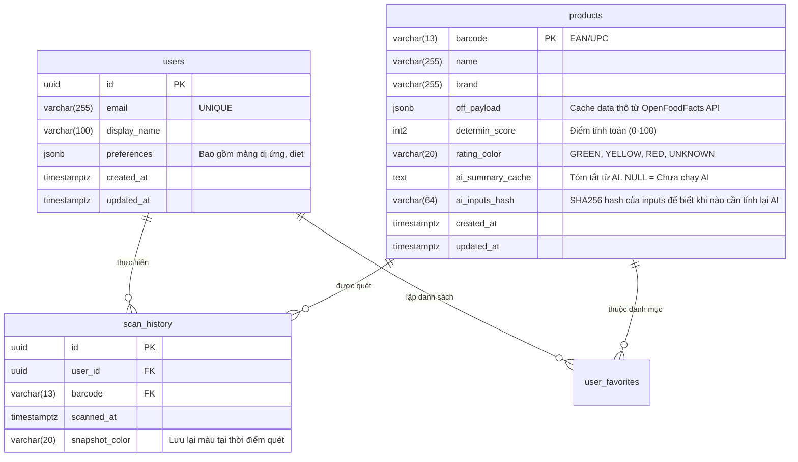

# Lược đồ Dữ liệu và Constraints (PostgreSQL V2)

Tài liệu thiết kế cấu trúc CSDL mức vật lý phục vụ khả năng chịu tải cao và tìm kiếm linh hoạt cho DICO Scan. DB sử dụng PostgreSQL 16+.

## 1. Sơ đồ Thực thể (ERD) - Cốt lõi

## 2. Table Schemas, Constraints & Indexes

### Bảng `users`
Bảng lưu trữ người dùng và cấu hình cá nhân.
- **Constraints**:
  - `email` phải duy nhất. (Unique Constraint).
  - Khóa chính sinh mặc định (UUID v4 mặc định DB).
- **Indexes**:
  - B-tree Index trên `email`.
  - **GIN Index trên trường `preferences`**: Hỗ trợ tìm kiếm siêu tốc trên JSON `user.preferences.allergies`.
  - `CREATE INDEX idx_users_prefs ON users USING GIN (preferences);`

### Bảng `products`
Bảng thiết yếu nhất, đóng vai trò như Product Catalog + Product Cache phân tích.
- **Constraints**:
  - `barcode`: Khóa chính (Primary Key).
  - `rating_color`: `CHECK (rating_color IN ('GREEN', 'YELLOW', 'RED', 'UNKNOWN'))` - Bắt buộc đúng Enumeration.
  - `determin_score`: `CHECK (determin_score >= 0 AND determin_score <= 100)`
- **Indexes**:
  - B-tree Index trên `updated_at`: Phục vụ truy vấn dọn dẹp bộ nhớ (Cache eviction policy cho các sản phẩm chưa ai quét hơn 3 tháng).
  - GIN Index (tùy chọn trong phase 2) trên `off_payload`: Tìm kiếm full-text search theo tên sản phẩm thuần túy.
  - Phím tìm Hash: Index trên `ai_inputs_hash` để AI caching resolver.

### Bảng `scan_history`
Lưu trữ log quét của người dùng.
- **Thiết kế mở rộng (Scaling design)**:
  - Bảng này lớn rất nhanh (Data-heavy). Ở góc độ vật lý PostgreSQL, thiết lập **Table Partitioning theo thời gian** (Range Partitioning by Month trên trường `scanned_at`).
  - Lợi ích: Khi xóa logs > 6 tháng, chỉ cần `DROP PARTITION`, không lock table.
- **Constraints**:
  - `user_id` map tới UUID người dùng cụ thể. `barcode` map tới product_code cụ thể. (Foreign Key Rules: ON DELETE CASCADE user, giữ nguyên product).
- **Indexes**:
  - 복합(Composite) Index: `CREATE INDEX idx_scan_hist_usr_time ON scan_history(user_id, scanned_at DESC);`. Tối ưu 100% tốc độ API fetch lịch sử quét của `MeController`.

## 3. Data Retention Lifecycle
Quy định thời gian sống của bản ghi (Xóa rác để tiết kiệm đĩa theo 14_BAO_CAO_CHI_PHI_TOI_UU.md).
- **products**: TTL 3 tháng. Một tiến trình Background cron sẽ chạy. `DELETE FROM products WHERE updated_at < NOW() - INTERVAL '3 months'`. (Sản phẩm bị xóa sẽ được gọi lại từ OFF nếu user vô tình quét lại).
- **scan_history**: Lịch sử chỉ lưu 6 tháng cho user tài khoản thường (BASIC). Chạy script truncate partition tự động vào mùng 1 hàng tháng.
